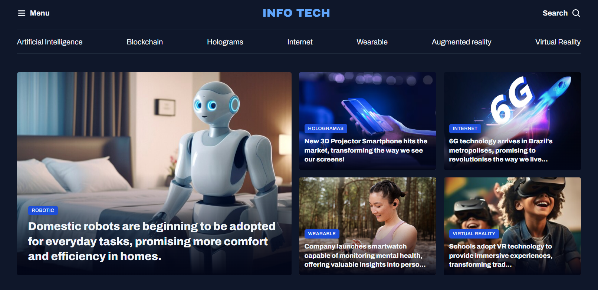

# 📰 Info Tech News Portal

This project is a demonstration of a **News Portal** webpage, created to practice and exercise the use of CSS Grid. The main focus was to build a visually appealing and well-structured layout using modern web development techniques.



## 🌟 Features

- **CSS Grid**: Extensive use of CSS Grid to create a complex and flexible layout.
- **Modern Aesthetic**: Clean and modern design with a dark theme, using custom fonts and smooth animations.

## 🛠️ Technologies Used

- **HTML**: The structure of the webpage, including semantic elements for better accessibility.
- **CSS**: Used to style the webpage, with a focus on:
  - **CSS Grid**: To create a flexible and responsive grid layout.
  - **Custom Properties**: To maintain consistency in the design, using variables for colours, fonts, and other styling aspects.

## 📂 Project Structure
```
/assets
├── /icons # Icons used in the project
├── /images # Images displayed on the webpage
├── Ads.png # Advertisement image displayed in the sidebar
├── image.png # The image of the project
└── Logo.svg # The logo of the webpage

/styles
├── global.css # Global styles and variables
├── header.css # Specific styles for the header
├── index.css # Imports and organises other CSS files
├── sections.css # Styles for different sections of the webpage
└── utility.css # Utility classes for grid and spacing
index.html # The main HTML file for the webpage
```

## 💡 How to Use

1. Clone or download the repository.
2. Open the `index.html` file in your preferred web browser.

## 🎨 Inspiration

The idea behind this project was to create a news portal with a modern design, based on the Rocketseat FullStack course, focusing on grid layouts to manage complex content structures efficiently. The dark theme, combined with vibrant accent colours, aims to provide a clean and engaging user experience.

